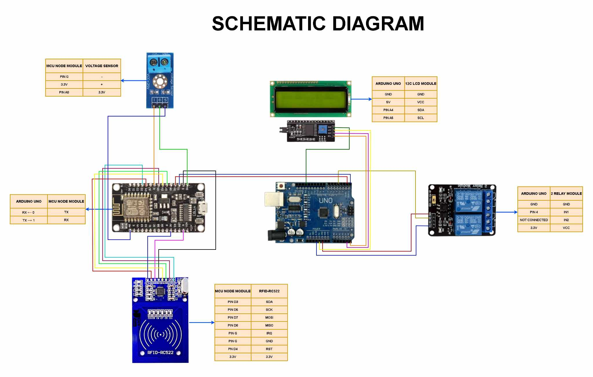

# rfidreader.ino
- This Arduino code is for reading the UID (Unique Identifier) of an RFID card using an RFID-RC522 module and an Arduino Uno (or similar board). It utilizes the MFRC522 and SPI libraries to communicate with the RFID module. This is what we use to store your RFID's UID to our system.

# ARDUINO.ino
- This Arduino code is designed for an RFID-based "Free Charging Station", where students can scan their RFID cards to activate a charging session. If their RFID card is verified, the system allows them to charge their devices for 15 minutes before automatically turning off.

